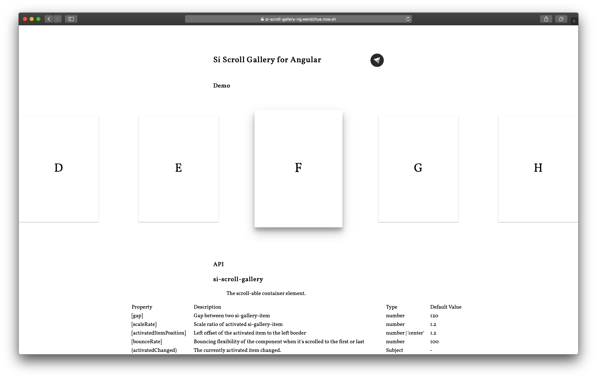

# @silicic/scroll-gallery-ng

A scroll-able gallery component.



[Demo](https://si-scroll-gallery-ng.wendell.site)

## Installation

Install with npm:

```shell
npm install @silicic/scroll-gallery-ng
```

## Usage

Import `ScrollGalleryModule`:

```ts
@NgModule({
  imports: [ScrollGalleryModule]
})
export class AppModule {}
```

And wrap `si-gallery-item` with `si-scroll-gallery` like this:

```html
<si-scroll-gallery
  [activatedItemPosition]="'center'"
  [bounceRate]="400"
  [gap]="120"
  [scaleRate]="1.1"
>
  <si-gallery-item>
    A
  </si-gallery-item>
  <si-gallery-item>
    B
  </si-gallery-item>
  <si-gallery-item>
    C
  </si-gallery-item>
</si-scroll-gallery>
```

## API

### si-scroll-gallery

| Property                  | Description                                                                   | Type                     | Default Value |
| ------------------------- | ----------------------------------------------------------------------------- | ------------------------ | ------------- |
| `[gap]`                   | Gap between two si-gallery-item                                               | `number`                 | 120           |
| `[scaleRate]`             | Scale ratio of activated si-gallery-item                                      | `number`                 | 1.2           |
| `[activatedItemPosition]` | Left offset of the activated item to the left border                          | `number | 'center'`      | 1.2           |
| `[bounceRate]`            | Bouncing flexibility of the component when it's scrolled to the first or last | `number`                 | 100           |
| `(activatedChanged)`      | The currently activated item changed.                                         | `Subject<void>`          | -             |
| `(draggingStarted)`       |                                                                               | `Subject<void>`          | -             |
| `(dragging)`              |                                                                               | `Subject<PointerVector>` | -             |
| `(draggingEnd)`           |                                                                               | `Subject<PointerVector>` | -             |

## License

MIT
